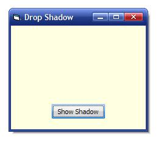



## Real Drop Shadow Form

### Description

Shows how to add shadow to form without using any subclassing. All using WinAPIs. Just 8 Lines of code.
 
### More Info
 

             |
---                |---
**Submitted On**   |2009-03-12 09:00:02
**By**             |[Abhishek\.NET](https://github.com/Planet-Source-Code/PSCIndex/blob/master/ByAuthor/abhishek-net.md)
**Level**          |Beginner
**User Rating**    |4.8 (24 globes from 5 users)
**Compatibility**  |VB 4\.0 \(32\-bit\), VB 5\.0, VB 6\.0
**Category**       |[Windows API Call/ Explanation](https://github.com/Planet-Source-Code/PSCIndex/blob/master/ByCategory/windows-api-call-explanation__1-39.md)
**World**          |[Visual Basic](https://github.com/Planet-Source-Code/PSCIndex/blob/master/ByWorld/visual-basic.md)
**Archive File**   |[Real\_Drop\_2146693122009\.zip](https://github.com/Planet-Source-Code/abhishek-net-real-drop-shadow-form__1-71862/archive/master.zip)

